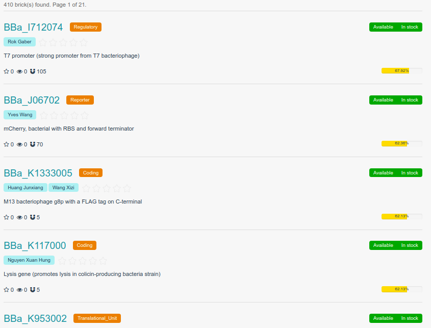
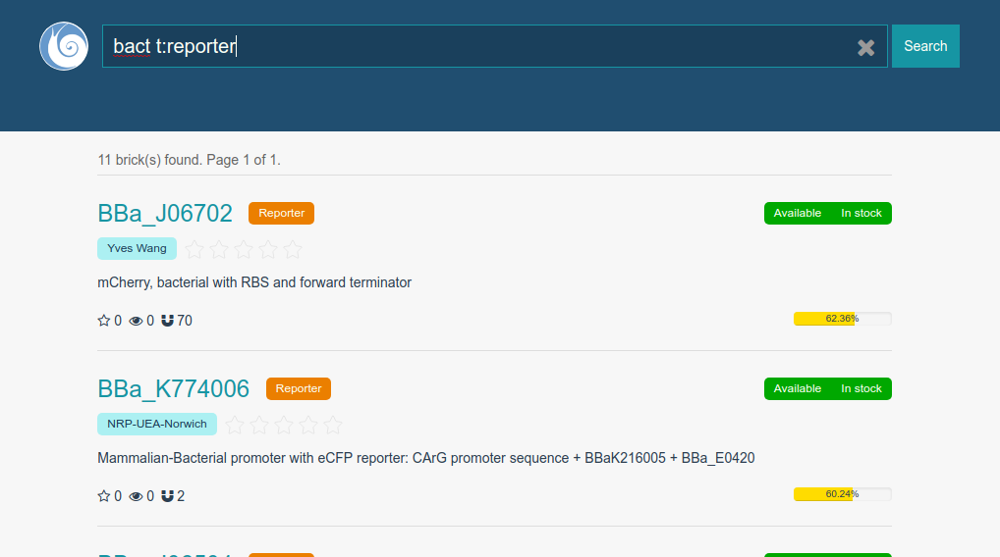
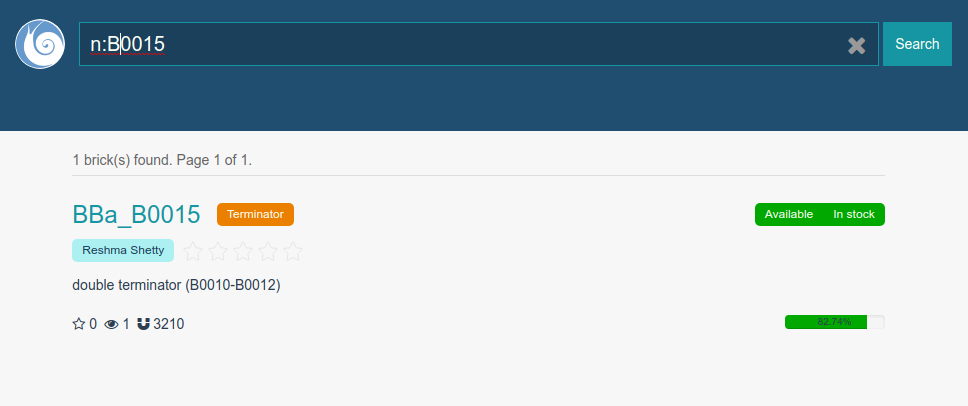
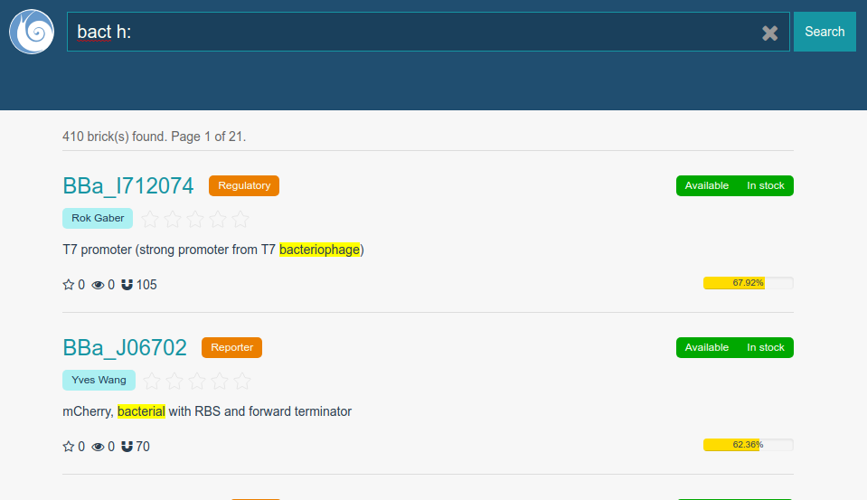
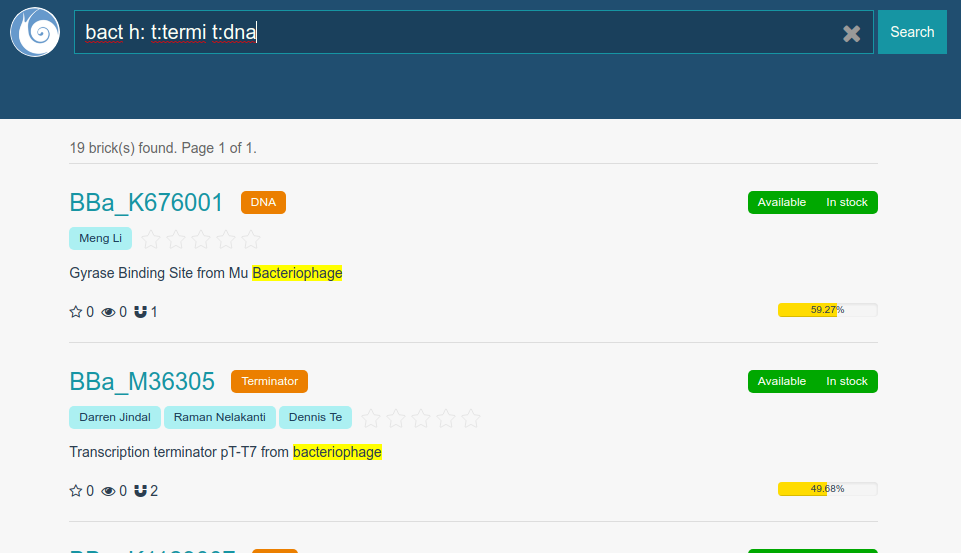

## Validation

### Unit Test
Our project is tested locally thousands of time. At the frontend, every changes we make will trigger `eslint` to check programming style and to find stupid mistakes. Before commiting a change, `nightwatch` and `karma` perform tests to see if everything runs well. Automated tests are also deployed at the backend. After pushing commits to our repository on github, travis CI will be activitated to build the project and run all the automated test scripts. All these features reduce the possibility of mistakes.

### BioSearch
Type anything you want to learn about a part and press Enter, in less than one second you will get the results:

    
The bricks are ordered by their qualities and creation date, which means you are always able to get the best and latest one to meet your need. The quality of bricks are ranked by several factors, including frequency of use, sample status, and assessments from users in forum, and so on. Each brick is displayed with a progress bar at the right bottom corner, which represents the relative ranking.

BioSearch supports multi-dimensional filtering. You can use `t:<type>` to limit the type of bricks:

or use `n:<part name>` to precisely locate a brick using its name:

or add an `h:` filter to mark out the matched words:

Multiple filters can also be combined to make complex query:

### Plugins

#### ABACUS:
ABACUS is a submodule of team USTC-Software-2016's project. ABACUS is firstly developed by professor Liu Haiyan, to enlarge the functions of Biopano. The de novo design of amino acid sequence to fold into desired structures is a way to reach a more thorough understanding of how amino acid sequences encode protein structures and to supply methods for protein engineering. To overcome limitations in current computational models, they developed a comprehensive statistical energy function for protein design with a new general strategy and verify that it can complement and rival current well-established models. They established an experimental approach which can be used to efficiently assess or improve the foldability of designed proteins. To prove it, they report four de novo proteins for different targets, all experimentally verified to the well-folded, solved solution structures for two being excellent agreement with respective design targets.[1]

#### bioBLESS:
bioBLESS is an adaption of team USTC-Software-2015's project. It is an integrated system based on Espresso, designed to construct and evaluate biological circuit. The project is available on GitHub, which means one can download all the source code and test it. Members of team USTC-Software-2015 use TravisCI for continuous integration and coverall for coverage test at the backend, while Chai, Mocha and phantomJs assure the website is displayed as expected.

