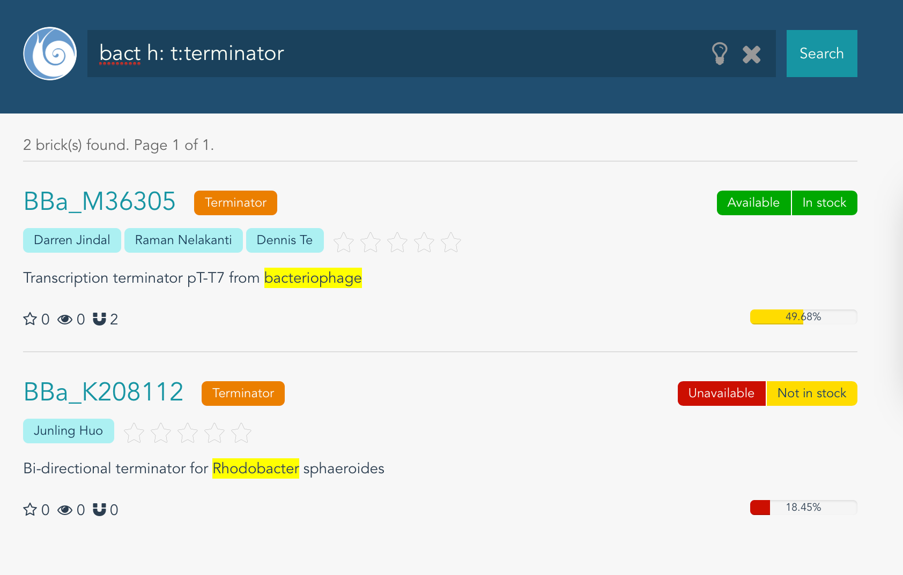
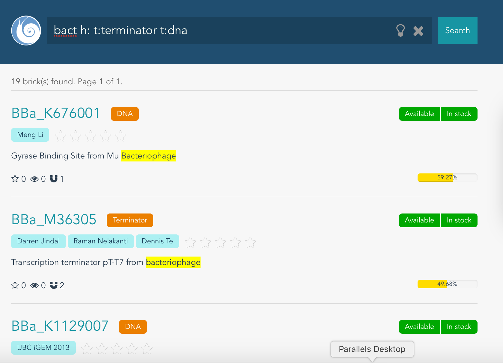
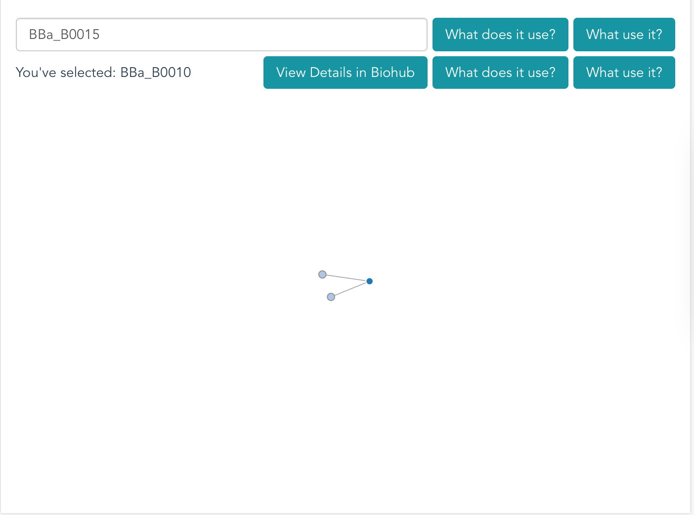
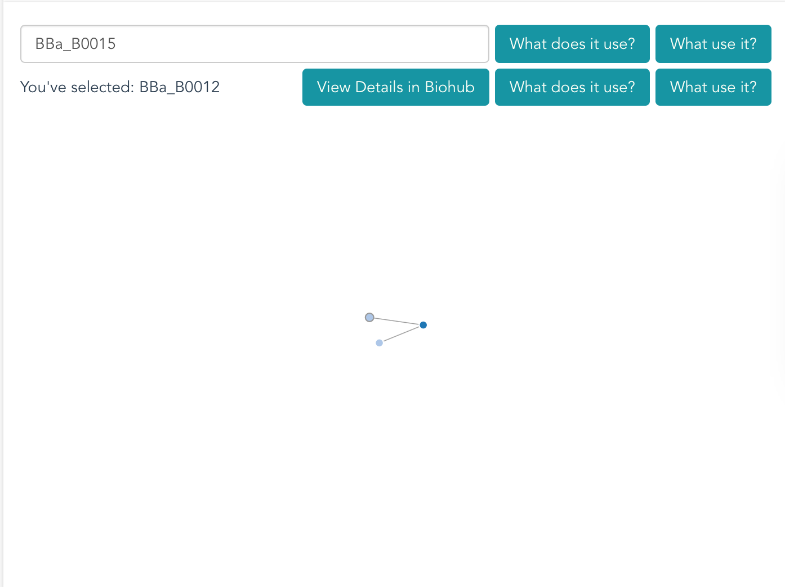
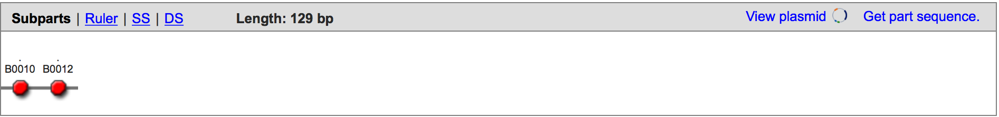
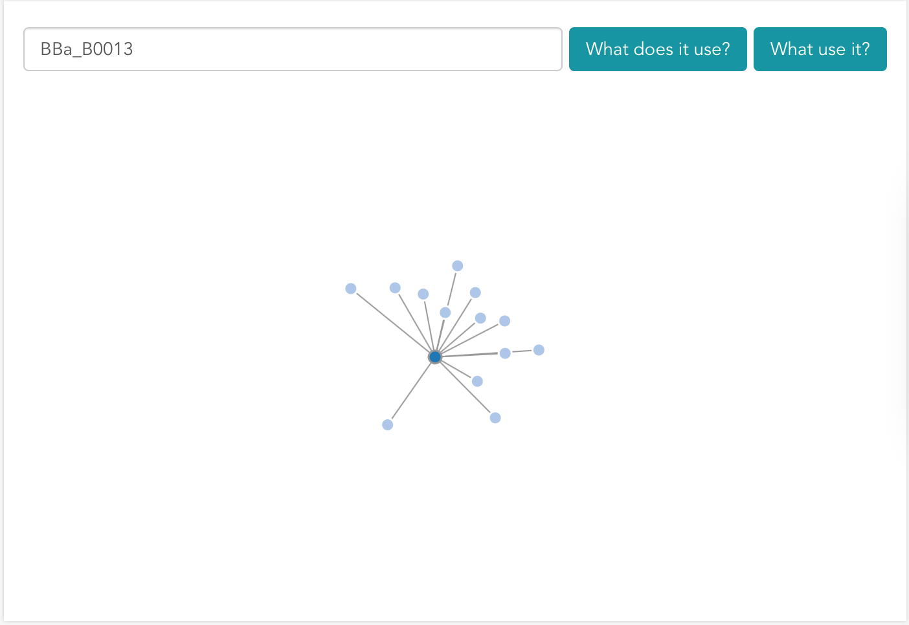
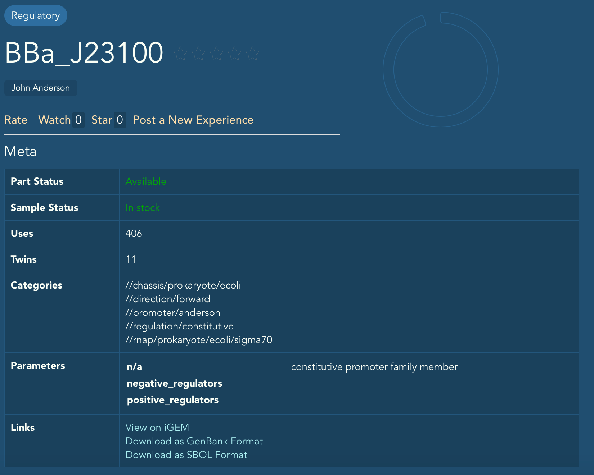
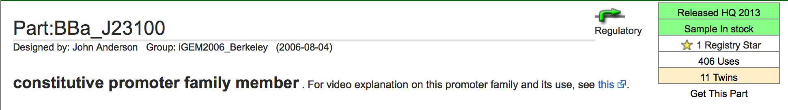
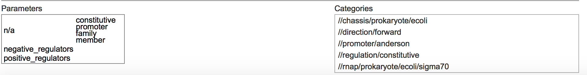

## Validation

### Unit Test
Our project is tested locally thousands of time. At the frontend, every changes we make will trigger `eslint` to check programming style and to find stupid mistakes. Before commiting a change, `nightwatch` and `karma` perform tests to see if everything runs well. Automated tests are also deployed at the backend. After pushing commits to our repository on github, travis CI will be activitated to build the project and run all the automated test scripts. All these features reduce the possibility of mistakes.

### BioSearch
We will prove our search function work by the following steps:

 + **Step 1**. Find bricks with suffix "0012":
    Input the pattern: 
    Get the results:
     
     
    From the screenshot you can see that, all the parts ranked by their factor 'weight'. (results are partly displayed)

 + **Step 2**. Find bricks with keyword **back**:
    Input the pattern: 
    Get the results:
    
    All the parts contain pattern "back" have been pick out. (results are partly displayed)

 + **Step 3**. Find bricks with type **terminator** and keyword **bact**:
    Input the pattern and get the results:
    

 + **Step 4**. Find bricks with type **terminator** or **dna** and keyword **bact**:
    
    There are 19 bricks found matching the patterns. (We only show several items of the results)

### Plugins

#### ABACUS
ABACUS is a submodule of team USTC-Software-2016's project. ABACUS is firstly developed by professor Liu Haiyan, to enlarge the functions of Biopano. The de novo design of amino acid sequence to fold into desired structures is a way to reach a more thorough understanding of how amino acid sequences encode protein structures and to supply methods for protein engineering. To overcome limitations in current computational models, they developed a comprehensive statistical energy function for protein design with a new general strategy and verify that it can complement and rival current well-established models. They established an experimental approach which can be used to efficiently assess or improve the foldability of designed proteins. To prove it, they report four de novo proteins for different targets, all experimentally verified to the well-folded, solved solution structures for two being excellent agreement with respective design targets.[1]

#### Biocircuit:
Biocircuit is an adaption of team USTC-Software-2015's project. It is an integrated system based on Espresso, designed to construct and evaluate biological circuit. The project is available on GitHub, which means one can download all the source code and test it. Members of team USTC-Software-2015 use TravisCI for continuous integration and coverall for coverage test at the backend, while Chai, Mocha and phantomJs assure the website is displayed as expected. For more details, visit [Validation of Biocircuit](http://2015.igem.org/Team:USTC-Software/Results#Validation).

#### BioMap:
BioMapis a plugin that can analyze the relationship between different bricks. Several bricks are chosen as our test cases. We will compare the result generated by BioMap with the official one.
Let's start by **BBa_B0015**. From the images you can see there are two bricks used by **BBa_B0015**, **BBa_B0010** and **BBa_B0012**.

Visit [BBa_B0015](http://parts.igem.org/Part:BBa_B0015) you can get all the  subparts **BBa_B0015** has:

They are identical.

Let's try a more complicate case, **BBa_B0013**. We are going to find which brick use it as a subpart.

**BBa_B0013** are found in 13 different bricks:
[BBa_K2037015](http://parts.igem.org/Part:BBa_K2037015)
[BBa_K2150029](http://parts.igem.org/Part:BBa_K2150029)
[BBa_K2150028](http://parts.igem.org/Part:BBa_K2150028)
[BBa_K2037012](http://parts.igem.org/Part:BBa_K2037012)
[BBa_K2150022](http://parts.igem.org/Part:BBa_K2150022)
[BBa_K2037014](http://parts.igem.org/Part:BBa_K2037014)
[BBa_K2150023](http://parts.igem.org/Part:BBa_K2150023)
[BBa_K294031](http://parts.igem.org/Part:BBa_K294031)
[BBa_K2037016](http://parts.igem.org/Part:BBa_K2037016)
[BBa_K294001](http://parts.igem.org/Part:BBa_K294001)
[BBa_I7013](http://parts.igem.org/Part:BBa_I7013)
[BBa_K2037017](http://parts.igem.org/Part:BBa_K2037017)
[BBa_K2037013](http://parts.igem.org/Part:BBa_K2037013)

#### Forum's Data Fetching
Although all the automated tests passed, they cannot determine the correctness of the data we fetched from iGEM's offical website. We will validate the data manually.
Take **BBa_J23100** as our test case. It has detailed documentation and experiences, not easy for data fetching.

**Basic Information**

And here is a screenshot of iGEM's official website.

You can see that all the data, including bricks type, author, part status etc., are identical.
Documentation and experiences are also fetched. We dont attach screenshots here. You can check by visiting [Our Results](http://biohub.technology/forum/brick/BBa_J23100/) and [Official Pages](http://parts.igem.org/Part:BBa_J23100)

