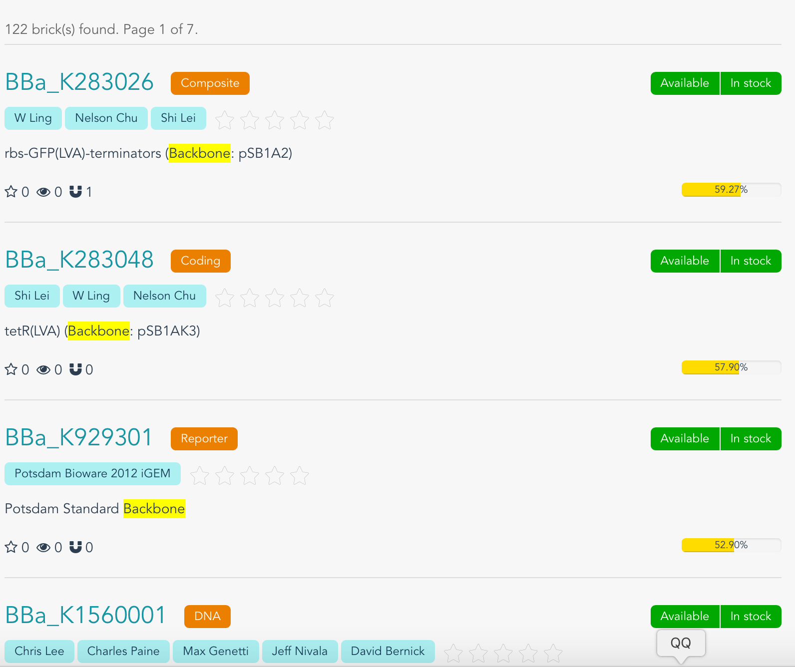

## Validation

### Unit Test
Our project is tested locally thousands of time. At the frontend, every changes we make will trigger `eslint` to check programming style and to find stupid mistakes. Before commiting a change, `nightwatch` and `karma` perform tests to see if everything runs well. Automated tests are also deployed at the backend. After pushing commits to our repository on github, travis CI will be activitated to build the project and run all the automated test scripts. All these features reduce the possibility of mistakes.

### BioSearch
We will prove our search function work by the following steps.
+ Find parts with suffix "0012":
    Input the pattern: 
    Get the results:
     
     
    From the screenshot you can see that, all the parts ranked by their factor 'weight'. (results are partly displayed)
+ Find parts with keyword "back":
    Input the pattern: 
    Get the results:
    
    All the parts contain pattern "back" have been pick out. (results are partly displayed)
    
    

### Plugins

#### ABACUS:
ABACUS is a submodule of team USTC-Software-2016's project. ABACUS is firstly developed by professor Liu Haiyan, to enlarge the functions of Biopano. The de novo design of amino acid sequence to fold into desired structures is a way to reach a more thorough understanding of how amino acid sequences encode protein structures and to supply methods for protein engineering. To overcome limitations in current computational models, they developed a comprehensive statistical energy function for protein design with a new general strategy and verify that it can complement and rival current well-established models. They established an experimental approach which can be used to efficiently assess or improve the foldability of designed proteins. To prove it, they report four de novo proteins for different targets, all experimentally verified to the well-folded, solved solution structures for two being excellent agreement with respective design targets.[1]

#### bioBLESS:
bioBLESS is an adaption of team USTC-Software-2015's project. It is an integrated system based on Espresso, designed to construct and evaluate biological circuit. The project is available on GitHub, which means one can download all the source code and test it. Members of team USTC-Software-2015 use TravisCI for continuous integration and coverall for coverage test at the backend, while Chai, Mocha and phantomJs assure the website is displayed as expected.

